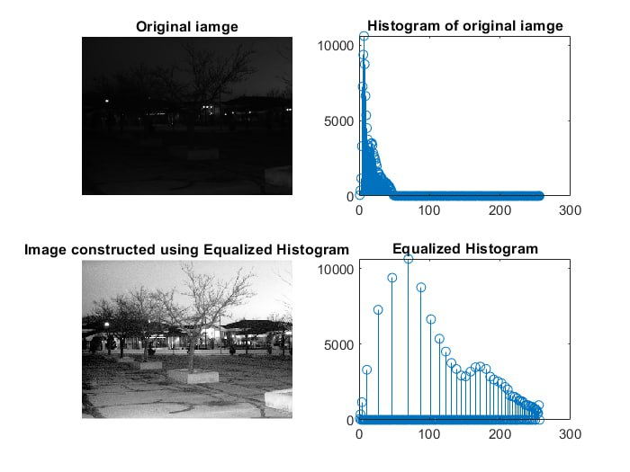

# Equalized_Histogram
Algorithm allows to convert night video and photos  almost in a day without using specific devices just by soft. After can apply Visual Odometry

Алгоритм зробить з ночі вигляд як наче ввечері. Потім можна буде знаходити точки для детекції і використання для технологій типу Visual Odometry

